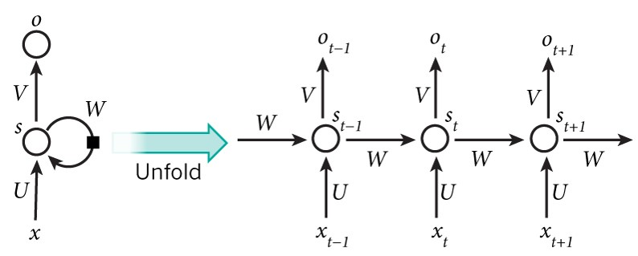
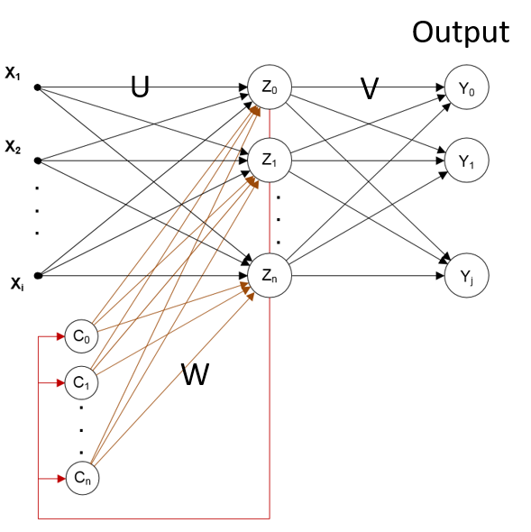
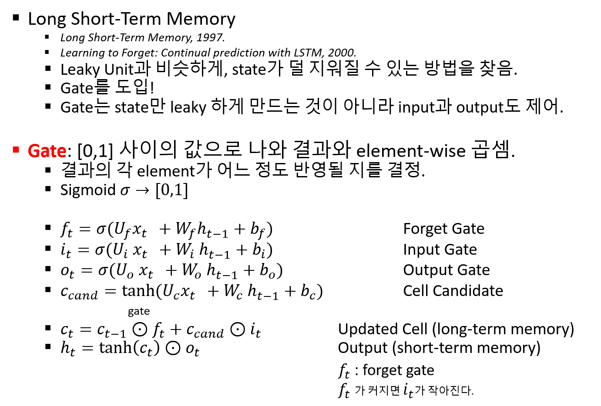
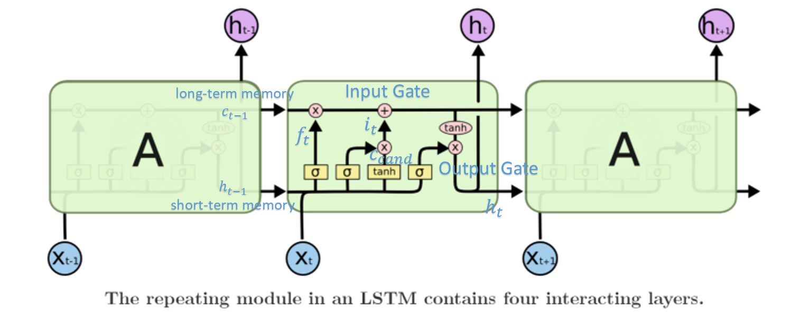

ⓒ JMC 2017


---

## 20171108 5주차

```
# [TIP] 프로젝트 빨리 하기

1. 논문 읽기 (scholar.google.com)
2. source code 찾아서 (github.com) 갖다 쓰기
3. 데이터 준비하기
  - 공짜 데이터, 벤치마크에 사용하는 동일한 데이터 찾기
  - ex. Wallstreet Journal Data, etc.
```

`CS 224S / LINGUIST 285 Spoken Language Processing`
`Stanford CS224S Spring 2014`


+ P(x|s) = P(s|x) P(x) / P(s)
  + P(x|s) : GMM
  + P(s|x) : DNN output
    + input x를 넣었을 때 s가 나올 확률
    + s : 어떤 state의 phoneme인가

**RNN**.

`rnn_architecture_2017통신.pptx`

$$y_t = f(x_t, y_{t-1}; \theta)$$

output을 input으로 feedback해주면 기억하는 효과가 있다.
메모리가 있는 것처럼 작동이 된다.



$U$, $V$, $W$가 변하지 않으므로 stationary system이라고 한다.
비유하면, $x_{t-1}$는 월 소득, $U$는 지출로 인해 변한 금액, $s_{t-1}$는 저축된 금액으로 볼 수 있다.
state는 저장되는 것인데, $s_{t-1}$이 $W$와 곱해지면 이자 소득으로 $s_t$로 변할 수 있다.

**RNN Language Modeling**.

예를 들어, "c"라는 글자를 LM에 집어 넣으면 다음에 나올 캐릭터 a, e, 등이 나올 확률이 각각 나온다.
"I like c"를 RNN LM에 집어 넣으면 "cat"이 나올 확률이 높게 나온다.
"c" 이전에 나온 시퀀스를 다 기억하고 있기 때문이다.

RNN 모델이 장점을 갖는 이유는 어떤 frame만 듣고 "c"냐 "k"냐를 파악하는 것보다 이전 frame을 포함해서 "c"냐 "k"냐를 파악하는 게 더 쉽기 때문이다.

**RNN 형태**.

+ 매 step마다 출력($o_{t-k}, \cdots, o_{t-1}, o_t$)이 필요하다 : Language Modeling
+ 마지막 step까지 진행한 후 하나의 출력이 필요하다 : Sentiment Analysis

**RNN activation function**.

+ sigmoid function : 0~1이기 때문에 중간값이 0.5이다.

+ tanh function : -1~+1이기 때문에 중간값이 0이다. 즉 (`miss`) bias가 없다.

+ ReLU function : 양의 값이 feedback 될수록 값이 너무 커지기 때문에 문제가 된다.

> **Note**: CS231N - Lecture 5 - activation function의 장단점 참고하기



**Before LSTM : Leaky Unit**.

$$h_{cand} = tanh(Ux_t + Wh_{t-1} + b)$$

$$h_t = (1-\alpha)h_{t-1} + \alpha h_{cand}$$

+ $\alpha = 1$ : `miss`
+ $\alpha = 0$ : 강력한 상속

**LSTM**.

short-term memory는 3~4 step 전까지는 기억하지만 수십 step 전까지는 기억을 못한다.
수십 step 전까지 기억하려면 수첩 어딘가에 써두면 된다.



위 notation을 토대로 LSTM 알고리즘을 도식화하면 아래와 같다.



**RNN training**.

`RNN training 목요일 실습 때 할 것`

---

(결석 2번)

---

## 20171030 4주차

**HMM 이어서**:
HMM에서 Hidden인 이유는 사람의 발음이나 필기체가 정확하지 않기 때문에.

+ 아이스크림의 개수 : 사람의 발음

음성인식 모델링이란 곧 HMM을 training하는 것.

HMM의 두 요소:

+ transition probability :
  + MM에 의한 state간 transition 확률
+ emission probability :
  + state에서 output을 emit하는 확률
  + 음성인식 : 가우시안 분포로 모델링 (여러 사람의 발음을 겹치면 가우시안 믹스쳐 모델 (GMM))

HMM의 emmision probability인 한 사람의 발음 데이터를 가우시안 분포로 모델링한다.
한 사람이 아니라 여러 사람의 발음 분포를 겹치면 가우시안 믹스쳐 모델(GMM)이 된다.
음성인식에서 HMM을 만드는 것이 training이다.

음성인식에서 어떤 사람이 '학_에 간다'를 발음했다.
빈칸에 들어갈 발음의 분포를 보니 '고'에 대한 emission probability가 90%이고, '교'는 5%라고 하자.
발음만 생각할 때는 '학고에 간다'라고 인식된다.
그런데 MM에 의해 '학고에'에 대한 확률보다 '학교에'에 대한 확률이 20배 더 높다.
그래서 '학교에 간다'로 고친다.

posterior.
의사의 진료.
아폴로 눈병이 돌고 있다고 한다.
따라서 눈곱이 낀 환자가 오면 아폴로 눈병일 사전확률이 높은 상태에서 진단을 내릴 수 있다.

**Decoding**:
어떤 사람의 발음을 듣고 문자로 인식하는 것을 decoding이라 한다.

decoding = 아이스크림 개수의 sequence(5개)를 보고 5일치 날씨를 채워 넣는 것.


decoding의 복잡도.
state 개수가 N개이고, 관찰한 sequence의 길이가 T라면 총 가능한 조합의 수는 $N^T$이 된다.
계산량이 너무 많으므로 음성인식으로 할 때 이런 방식으로 할 수는 없다.
계산량을 줄이는 방법에 대해 알아본다.

**Forward 알고리즘**:

오늘(t) 모든 state에서 다음날(t+1)에 어느 state로 갈지 각각 확률을 구한다.
state 개수가 N개이고, 관찰한 sequence의 길이가 T일 때, $\alpha_t(N_1), \cdots \alpha_t(N_N)$까지를 $T$번 계산하므로 복잡도가 $N^2T$로 줄어든다. `노트 참고`

+ $\alpha(t)$ : 오늘
+ $\alpha(t-1)$ : 어제

$$ \alpha_t(j) = \Sigma_{i=1}^{N} \alpha(t-1)(i) \times a_{ij} \times b_j(o_t) $$

+ $\alpha(t-1)(i)$ : 어제 state가 i일 때
+ $a_{ij}$: state i에서 state j로 이동할 transition probability
+ $b_j(o_t)$ : 오늘 state가 j일때 emission probability

**Viterbi 알고리즘**:

forward 알고리즘의 변형.

$$ V_t(j) = max_{i=1}^{N} v(t-1)(i) \times a_{ij} \times b_j(o_t) $$

forward 알고리즘으로 계산되는 $\alpha_t(N_1) \cdots \alpha_t(N_N)$ 중에서 가장 큰 값만 남긴다.
Viterbi 알고리즘은 계산의 복잡도가 줄어든다고 보장할 수는 없고 approximate하는 것이므로 forward 알고리즘을 더 잘 이해할 필요가 있다.

`---`

MM은 현재 state가 같으면 과거 state는 고려하지 않는다.
decoding은 과거 state를 모두 고려한다.

`p.28하단`
MFCC로 얻은 10msec 간격의 음성 데이터를 HMM에 넣는다.

`휴식`

$N^T$ 계산이 걸리는 일반 알고리즘과 forward 알고리즘의 차이 `노트 필기`

`p.32`
bigram.


**음성인식기 만들려면 필요한 것**:

1. 각 phoneme에 대한 emission probability
2. Lexicon - HMM 모델 (ex. five = f → ay → v) - transition probability
3. Language Model : 다음 단어가 나올 확률 (I'm going to 뒤에 school이 나올 확률)

corpus를 사용해서 1, 2로 HMM을 만든다.

HMM을 만드는 것은 encoding, 오늘 우리가 한 것은 Decoding.


**음성인식기 히스토리**:

1. 전통적 방법
  + Emission : GMM
  + HMM
  + Trigram
2. 현재까지
  + Emission : DNN
  + HMM
  + Trigram (language model)
3. 현재 이후
  + 모두 DNN으로 처리

 **끝.**

---

## 20171025 3주차

`CS224S Dan Jurafsky`

**MM vs. HMM**. 사전 복습.
Markov 모델은 현재 state에서 다음 state로 이동하는 것(trainsition)을 확률로 모델링한 것이다.
MM은 2학년 학생의 현재 state에만 관심이 있다.
이 학생이 2학년에서 낙제가 될지 어떨지 관심이 없다.
2학년이라는 것에만 관심이 있다.
HMM은 현재 학생이 몇 학년인지 모르는 것이다.
어떤 학생이 4학년이라면 이전에는 3학년으로 추정할 수 있다.
하지만 취업준비나 고시공부하느라 작년에도 4학년일 수도 있다.
이렇게 이중 모델 확률이 HMM이다.
현재 state를 잘 알지 못하고, 바깥에 오는 것을 관찰하여 state를 추정하는 것이 HMM이다.

MM: 현재 state를 아는 것.

알고 있는 곡의 피아노 건반을 치는 것은 현재 음을 알기 때문에 hidden은 아니다.
"동해물과 백두산이"와 같은 음의 sequence가 나오면 애국가라고 알아차릴 수 있는 것은 Markov model이다.
글자 하나하나를 state라고 했을 때, '나' 이후에 '는'이 나오면 MM이다.
'나' 이후에 알아볼 수 없는 글자(A)가 나오면 Hidden이다.
A에 나올 글자가 '는'일 확률이 70%, '에게'가 나올 확률이 몇 퍼센트, 이런 식으로 hidden을 추정한다.

`성원용_Lec3-HMMs-forward-backward.pdf`

'나는 학고에 갔어'라는 문장이 나오면 Language Model로 교정할 수 있다.
'학' 뒤에 '교'가 나올 확률은 30%, '생'이 나올 확률은 20%, '고'가 나올 확률은 1% 이런 식으로 알 수 있기 때문이다.
음성 인식도 마찬가지이다.

음성 인식은 사람이 말했을 때 달팽이관 세포를 시간에 지남에 따라 건들이는 것을 o1, o2, o3, ..., ot라고 한다.
MM을 적용할 때 중요한 것이 Bayes Rule이다.

**Posterior = Likelihood X Prior**.

$P(w | o) = \frac{P(o | w)P(w)}{P(o)}$

+ $o$ = 소리 ($o_1, o_2, o_3, \cdots , o_t$)
+ $w$ = 소리를 듣고 인식한 글자

+ $P(o | w)$ : 여러 사람이 발음한 'ㅏ, ㅓ, ㄱ, ...'와 같은 발음의 분포에 대해 평균과 표준편차를 계산한 '단어($w$)에 따른 소리($o$) 분포' 확률 모델. 즉, 발음이 어떠한 소리 분포를 가졌느냐. 음성인식 훈련이란 $P(o | w)$를 학습하는 과정이다. 사람의 발음 소리를 많이 모아야 한다. MFCC를 거쳐서 39차 parameter를 가진다.

예를 들어, $P(o | w)$를 봤더니 이 사람이 '나는 학고에 갔다'라고 발음을 했다는 것을 알았다.
그런데 뒤에 $P(w)$를 봤다.
$P(w)$는 많은 텍스트를 통해 훈련한 단어 모델(=언어 모델)이다.
텍스트에는 '학고'라는 단어가 거의 없거나, '나는' 뒤에는 안 나올 것이다.
그래서 $P(w)$를 통해 '학고'를 '학교'로 고칠 수 있다.

음성에서 $P(w)$는 마르코프 모델이다.
음성은 sequence이다.

SEQUENCE Prediction:
  + Markov Model : '무엇 다음에 무엇이 나올 확률이 높다.'
  + Roc ... ?

**Analogy**.

지카바이러스 감염 여부 판단.
+ Likelihood : P(머리둘레 | 소두증)
+ Prior : P(소두증)

Likelihood는 소두증에 걸린 사람만 모아두고 머리둘레를 측정해서 머리둘레의 분포(가우시안 확률분포)를 알아낸 것이다.
예를 들어, 두 환자의 Likelihood가 동일하더라도 한국에 사는 환자에 비해 브라질에 사는 환자의 Prior가 더 크므로, 브라질 환자가 지카 바이러스에 감염될 확률이 더 높다.
가령 희귀병에 걸린 사람은 의사들이 파악하는 데 오래 걸린다.
왜냐하면 prior인 $P(w)$가 낮기 때문이다.

Likelihood는 Generative Model이다.
$P(o|w)$는 발음을 듣고 소리의 분포를 알아내는 것이다.
소리를 듣고 각각 확률값이 어떠게 되는지 안다.

음성인식 통화 기계에서 인식의 정확도를 높일 때도 사전 확률 $P(w)$를 사용하면 된다.
수첩에 있는 전화번호를 $P(w)$로 쓰면 되기 때문이다.
인식된 번호가 수첩에 있는 번호라면 전화를 걸고, 아니라면 한 번 더 사용자에게 물어보게 하는 방식으로 말이다.

`p.3 하단`
decoding: 가장 확률이 큰 것을 골라내는 것 = argmax.


`휴식`


`p.6 상단`
Lexicon이란 단어와 그 단어에 해당하는 발음이 들어있는 사전이라고 보면 된다.
Lexicon은 HMM으로 나타낸다.

HMMs for speech.
'six' 발음.
's' 발음이 한번에 끝나지 않고 머무므로 뱅글뱅글 도는 표시가 있다.
's' 발음이 그 뒤에 'ih' 발음이 온다.
$a_{12}$: 1에서 2로 간다.

Monophone model.
각각의 음을 하나로 나타낸 것.

Monophone model:
+ single state
+ three state (tri-state)

`p.8`
digit recognition.
사람의 발음을 피아노 치듯이 나타내면 따라가기 쉬울 것이다.
'우어'라고 발음하면 't' 발음은 확률이 0이다.
그런데 말이 길면 p("one")일 확률이 p("oh") 보다 높아진다.

두 가지 확률이 있다. 'z'가 될 확률, 모두 연결되어 특정 Markov Model이 될 확률. `???`

`p.10`
**MM**.
RNN보다 간단한 모델이다.
Markov Assumption 덕분에 decoding이 쉽다.
$P(q_i | q_1 \cdots q_{i-1}) = P(q_i | q_{i-1})$.
어떤 학생이든, 어떤 과거를 가졌든, 현재 state에 해당하면 다음 state로 이동할 확률을 모두 동등하게 취급한다.
그러니 정밀한 모델은 아니다.
1학년 때 낙제한 학생이나 스트레이트로 승급한 학생이나 현재 두 학생 모두 3학년이면 4학년으로 올라갈 확률이 같다고 가정한다(1학년 때 낙제한 학생이라면 3학년 때 낙제할 확률이 있을 수 있으나 무시).

`p.13`
HMM에 대한 예시.
아이스크림.
아이스크림의 개수를 보고 날씨를 구분하기.

글자수나 단어수가 많을 때, 가령 10만 단어일 때 RNN을 쓰면 백 단어로 후보가 줄어든다.

**음성인식 기계를 설계한다는 것의 의미**.

+ $P(w)$ : state transition probability = prior
+ $P(o | w)$ : likelihood
  + $P(1 | cold)$ : emmision probability (HMM terms)
+ $w$ = hot 또는 cold와 같은 state = 영어 phoneme 46개 각각
+ $o$ = 아이스크림 개수 3, 1, 3 = MFCC의 계수(스펙트럼)
  + 39차 MFCC : 매순간 39가지 주파수에 관련된 특징을 적어놓는다.
+ Markov 모델 = 텍스트 모델 = sequenec의 Prior를 계산하는 방법


**HMM의 3가지 핵심 문제**.
1. Evaluation : transition 확률과 각 state의 likelihood확률을 곱해서 계산하는 것
2. Decoding : Evaluation 이후 어느 것이 max인가
3. Learning : $P(O | model)$을 maximize하는 parameter를 찾도록 training하는 것

오늘은 1, 2번을 중점적으로 배웠다.

> **Note**: $P(O | model)$에서 model이란 HMM model을 뜻한다.

`p.24`
다음 시간 Viterbi 알고리즘 배운다.
계산을 간단하게 하는 방법에 대한 이야기.


---

## 20171023 3주차

**sound wave**. 전파와는 다르다.
빛이나 라디오 주파수는 전자파이다.
sound wave는 공기 중의 질소나 산소를 미는 것이다.
그래서 sound pressure wave라고도 한다.
sound wave는 전자기파보다 느리므로 속도 차이가 엄청나게 난다.

오늘은 말(talk)을 어떻게 produce하는가를 이야기한다.
허파에 공기가 들어가고, 그 위에 있는 성대(vocal cord)에서 진동이 생기고, 진동은 성도로 올라가서 입 밖으로 나온다.
목소리에는 유성음과 무성음이 있다.
가령 '스' 같은 발음은 떨리지 않는 무성음이다.
유성음은 진동이 있는데, 이 진동의 주파수에 따라 높은 음이나 낮은 음의 소리가 나면서 음계가 달라진다.
고음을 잘 내는 사람은 그만큼 성대(vocal cord)를 잘 컨트롤할 수 있다는 뜻이다.

**Excitation = vocal cord**.
Excitation과 Excitation으로 vocal tract(=관)을 소리를 구분할 수 있다(?).

사람은 vocal tract이 길다.
피리의 길이가 긴 것과 같은 이치이다.
vocal tract이 긴 만큼 다양한 소리를 낼 수 있다.
개는 vocal tract이 매우 짧다.

Pitch: 도레미파솔라시도 음계.
같은 말로 fundamental frequency라고도 한다.
시간축에서 어떤 소리를 냈을 때 sound wave의 반복되는 간격이 Pitch이다.
낮은 음의 소리를 내면 Pitch가 늘어난다.
발음에 따라서 달라지는 것은 wave form이다.

음성의 2가지 요소.
lid를 진동시키는 주파수를 컨트롤 한다.
그 주파수가 pitch이다.
소리가 전달되는 파이프의 길이를 조절해서 wave form을 필터링한다.
vocal cord는 도레미파솔라시도 같은 pitch(fundamental frequency)를 결정한다.
vocal tract(mouth 포함)는 어떤 발음일지 음소를 결정한다.

**Phonemes vs. Phones**.
사람의 발음은 피아노처럼 딱딱 떨어지게 되지 않는다.
Phonemes: '아에이' 같은 것. 영어에는 42개가 있다.
Phone: 수천 개.

Phoneme을 classify하는 법:
+ Vowel: Front, Mid, Back. 혀의 위치에 따라 구분된다.
+ Consonant : 마찰음, 등

**Discrete-time Model for Speech Production**.
bandpass 3개 이상이 되는 digital filter를 만든다.
vocal tract 역할을 하는 것이 digital filter이다.
사람의 목소리와 비슷하려면 digital filter가 1초에 50번 이상 변해야 한다.

**Feature Extraction**.
디지털 필터의 모양을 아는 것.
음성 인식에서는 pitch-period는 중요하지 않다.
유성음이나 무성음이냐가 중요하다.
음성인식에서는 디지털 필터의 주파수를 아는 것이 중요하다.
그것을 feature extraction이라고 한다.

사람의 목소리가 vocal tract filter를 거치면 복잡한 wave form이 나온다.

vocal cord를 10Msec(=100Hz)로 소리 낸다고 해보자.
입에서 나오는 소리는 같은 주기이지만 다른 형태로 나온다.
vocal cord를 FT한 주파수를 digital filter를 통과시킨 주파수에서 가장 높은 주파수가 무엇인지 아는 것이 중요하다.


**음성 인식 Feature Extraction**.
+ MFCC
+ MEl Frequency Break Spo..

**Mel Scaled-Filter Bank**.
높은 주파수로 갈수록 넓어진다.
사람의 귀에서 원리를 따온 것.
낮은 주파수로 갈수록 filter bank가 좁아진다.
filter bank가 좁다는 것은 그만큼 섬세하게 잡아낸다는 것을 뜻한다.
filter bank는 20몇개로 구성된다.
사람의 달팽이관에 있는 hair cell(신경세포)과 동일하게 개수를 맞추기 위해서.
각 filter bank에 있는 signal을 서로 비교해서 어느 filter bank의 signal이 더 큰지를 따진다.

**Cepstrum(캡스트럼)**.
피치의 주파수에서 이상한 것을 제거하는 것.
곱셈을 없애려면 log를 취한다.
log(A*B) = log(A) + log(B).
A = 피치 주파수. 빨리 변하는 성분.
B = vocal tract이 만드는 성분. 천천히 변하는 성분.
여기에 low-pass filter를 적용하면 느리게 있는 성분(B)만 골라낼 수 있다.
즉, 피치 성분을 없애서, 여자 목소리같은 고음이나 남자 목소리 같은 저음의 목소리 변화는 다 없애버리고 중저음의 목소리만 남긴다.

Excitation signal.
100Hz 마다 반복되는 시그널.

w는 주파수.
`S(w)=E(w).H(w)`


Ex.
+ x(n) time domain signal.
  + 피치가 40msec = 250Hz.
  + 여자 목소리일 가능성.
+ windowed signal
  + 가장 자리에는 작은 값을 곱하고 가운데에는 큰 값을 곱한다.
  + 그러면 가운데 모양만 살아남는다.
+ FT | x(w) =dft(x(n))
  + ...
+ Log 스케일로 보기
  + 3개의 filter bank를 지나는 speech라는 것을 알 수 있다.
+ C(n) = iDft(Log(|x(w)|)
  + ...


**Feature Extraction Using MFCC**.

Input Speech =>

1. Framing and windowing : time-domain에서 가운데 값만 남긴다. 목소리가 '가나다라마바사'일 때 대략 20msec 동안은 목소리가 동일한 음이 난다고 생각을 한다. 그림을 50msec로 넘기면 사람은 움직이는 그림으로 인식하는 것과 같은 원리이다. 목소리를 나눌 때도 10msec~20msec로 나누면 목소리가 stable하다. 그렇게 잘라서 spectrum analysis를 한다. 1초짜리 음성을 분석할 때는 20msec 윈도우를 50번 해야 한다.
2. Fast Fourier Transfrom : 주파수별 성분을 표시한다.
3. Absolute value :
4. Mel scaled-filter bank : 완만한 선을 만든다. 방법은 다음과 같다. k=1, ... 20. k값에 따라 그 구간의 값을 측정한다. Neural Network에 집어 넣으면 인식 결과가 "Hello"라고 생긴다. 짧은 간격의 골(계곡의 골)을 없애서 신호를 부드럽게 바꾼다. 이를 MFCC라고 한다. pitch를 없애면 인식이 더 잘 된다. 피치의 영향을 없애는 게 MFCC인데 지금은 training data가 많아서 MFCC를 굳이 쓰지 않는다. ex. pitch 간격 = 100hz 사이의 골.
5. Log :
6. Discrete cosine transform :

=> Feature veoctors

음성인식을 할때는 4번 이후의 값이나 6번 이후의 값을 사용한다.
훈련데이터가 적을 때는 6번 이후의 값을 사용하는 게 유리하다.
4번을 하면 훈련데이터가 줄어드는 셈.
Neural Network 덕분에 훈련데이터를 쉽게 만드는 방법이 많아졌다.

Windowing에서 제일 많이 쓰는 게 HAMMING WINDOW이다.

**Feature Vector**.
+ MFCC : 13차 계수를 얻는다. Mel frequency를 지나면 계수가 20 몇 개로 줄어든다. FT를 한다.
+ Delta MFCC : C(n)-C(n-1) (C=계수. C(n)= frame 된것)
+ Delta Delta MFCC : DD(n) = D(n) - D(n-1)
  + 말을 하면 반사되어 오는 게 문제가 된다.
  + 반사되는 주파수는 어떻게 없앨까.
  + 사람의 vocal tract 길이에 비해 방의 크기는 훨씬 더 크다.
  + 거인의 vocal tract가 일반인에 비해 500배처럼 엄청 더 크다고 하면 말을 알아듣기 힘들 것이다. 왜냐하면 매우 낮은 주파수일 것이기 때문에.
  + 반사된 주파수를 없애는 것이 Delta 또는 Delta Delta이다.
  + Delta는 일종의 filter라고 볼 수 있다.
  + 덧셈은 ..-pass filter, 뺄셈은 ..-pass filter `10.23.11:46 rec ~37:20~`

39차 => GMM or HMM => 음성인식

Mel을 집어 넣어서 => 음성인식

**음성인식 방법**.
1. MFCC + GMM + HMM
2. Filter bank + DNN + HMM
3. Filter bank + RNN(CTC) + 간단한 decoding

1번 방식은 점점 사라지는 중. 2번째는 실용적으로 가장 인식률 높음. 그런데 슬슬 없어짐. 3번째가 떠오르는 방법.


---

## 20171018 2주차

이전 시간에는 filtering을 해서 원하는 신호만 끄집어 내는 것을 했다.
이번 시간에는 어떤 신호를 없애기보다는 신호의 주파수를 분석한다.

Sine wave의 주파수.
주파수는 1초에 몇 번 진동하느냐를 의미한다.
사람의 귀는 20~20,000Hz(20Khz)를 인식할 수 있다.
1초에 20번 진동하는 소리부터 20만 번 진동하는 소리를 들을 수 있다.
1초에 20번 진동하는 소리를 Time Domain(시간축)으로 시각화하면 1초 동안 20번 반복되는 패턴(sine wave 형태)을 볼 수 있다.
Time Domain 상에서 반복되는 패턴 하나가 시작해서 끝나기까지 걸리는 시간을 주기라고 한다.

> **Note**: 신호에서 반복되는 패턴을 cycle이라고 한다.

+ 주기(T) = 1Msec = 1/1000sec = 1000Hz = 주파수(freq)
+ 주기(T) = 5Msec = 1/200sec = 200Hz = 주파수(freq)
+ 주파수(freq) = $\frac{1}{T} Hz$
+ angular freq = $\frac{1}{T} * 2 \pi \ radian$

> **Note**: $2 \pi$는 한 바퀴를 의미한다.

Fourier Transfrom.
original 신호는 여러 가지 신호가 합쳐진 것으로 볼 수 있는데, 여러 가지 신호는 original 신호의 정수배로 이루어져있다..
피아노 C음 520Hz를 시각화하면 복잡한 모양이다.
거기에는 520Hz, 1040Hz, 1560Hz가 섞여 있다.
FT(푸리에 트랜스폼)이 하는 일은 복잡한 모양의 original 신호(기본 주파수)를 1x, 2x, 3x의 성분의 크기를 알아내는 것이 목적이다.
그것을 Harmonics(고조화)라고 한다.

> **Note**: 특정 주파수만 가진 단일 음을 들려주면 사람이 듣기에 좋지 않다. 장난감 피아노 소리가 듣기 좋지 않은 이유도 같은 맥락이다.

FT의 식은 적분식이다.
적분을 하는 이유는 기본 주파수에 어떤 주파수의 성분이 많이 들어 있는지 알 수 있기 때문이다.
왜냐하면 같은 주파수를 적분하면 값이 커지고, 다른 주파수를 적분하면 값이 작은 성질이 있기 때문이다.
공식에서 $f(t)$와 $w$의 공진 주파수를 찾는 방법이 적분인 것이다.

Discrete Fourier Transform.


---
